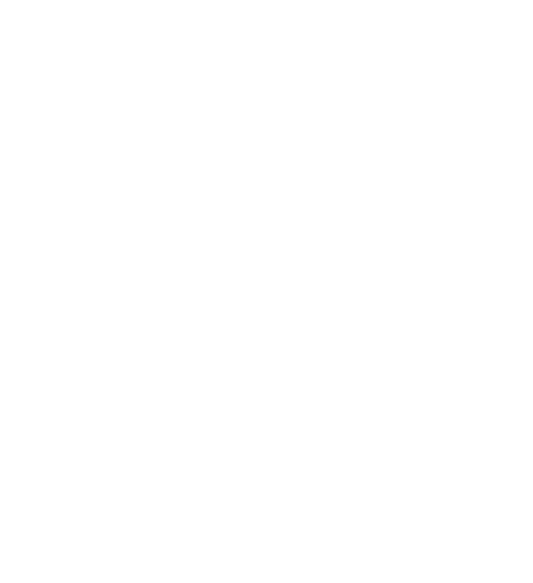

# OmniSport 🥊
### About
Backend API for a comprehensive ERP system for managing a martial arts club. Designed to provide full control over attendance, payments, and the club's community.
### Tech Stack
- Java 17
- Spring Boot 3.3
- PostgreSQL 15
- Flyway 10.15
- Hibernate
- Maven
- Docker

### Features 
- JWT-based security (Spring Security)
- Result pagination
- Database migrations with Flyway
- DTO pattern implemented
- Relations between entities
- Authorization and login
- Global exception handler

### Getting started
Make sure you have Docker and Postman installed
1. Clone the repository
2. Build and start the application
```bash
docker compose up --build -d 
```
3. The application will be up running at `http://localhost:8080`
4. Open Postman and import JSON file (api/postman/OMNISPORT API.postman_collection.json)
5. Log in as an admin by sending JSON in the OMNISPORT API/Auth/2. Authenticate
```
{
    "email": "szef@omnisport.pl",
    "password": "password123"
}

```
6. To stop the containers, run:
```bash
docker compose down 
```

### Database Structure

